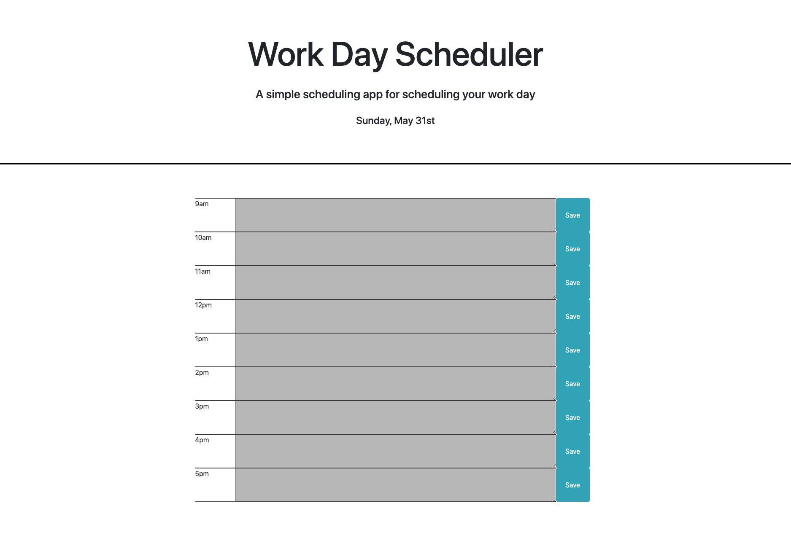

# Work-Day Scheduler

This application creates a simple 9am-5pm hourly scheduler in which a user can type to-do's, a schedules, notes, and other useful information within each hour and save the information from day to day and saved in memory once the user clicks Save. The time at the top of the page updates with the current day.

## Click [Here](https://kingsleyramos.github.io/Work-Day-Scheduler/) for deployed application.
---

## Tool & Resources
---
* [Bootstrap](https://getbootstrap.com/) - CSS framework used
* [JQuery](https://getbootstrap.com/) - JavaScript library used
* [Moment.js](https://momentjs.com/) - Date/Time API

## Assignment Challenges

This homework was not as difficult as last week's but the most difficult part about this project was trying to learn how to use moment.js. The documentation was not as clear and also quite long. I mainly used Google to assist with how to use the moment() function correctly, how to pull certain information, and how its formatted. I fellow classmate suggested to use Youtube as well to learn moment.js.

## Take Aways

This homework made me realise that there will be times a client or a project will require something i've never done before and it is up to me to learn it as soon as possible and implement it correctly. This was just it with moment.js.